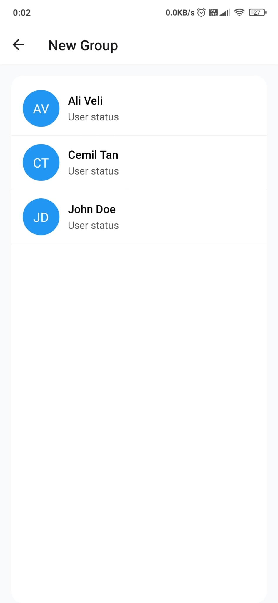
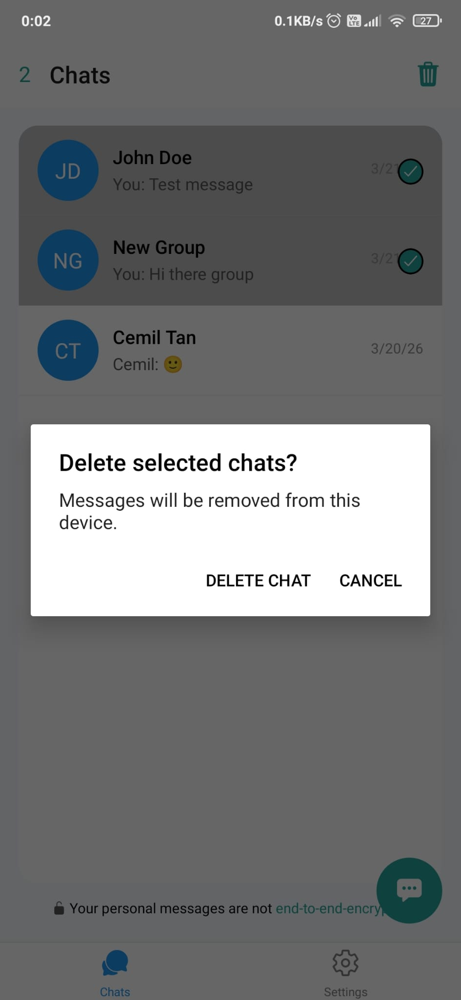
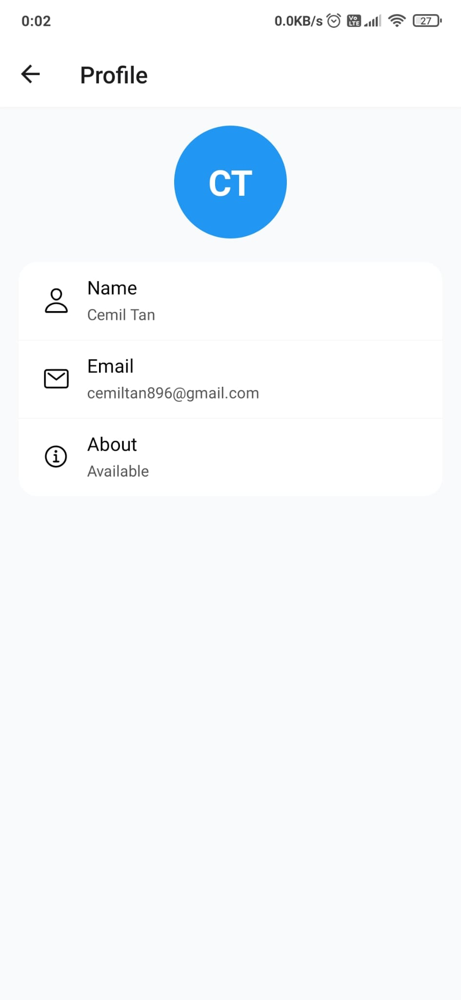
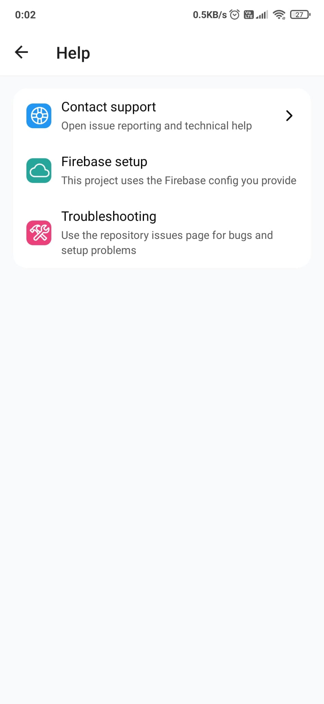
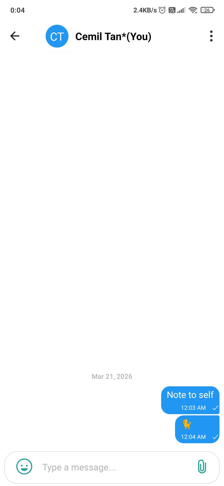
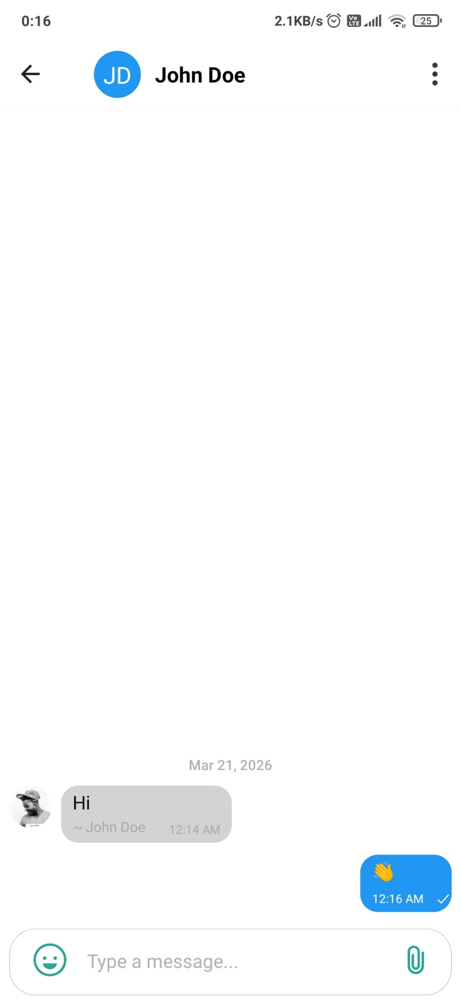
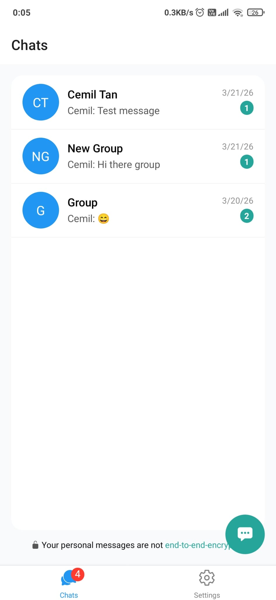

# React Native Chat App

A real-time chat app built with React Native, Expo, and Firebase.

## Overview

This project includes:

- Email/password authentication
- Real-time one-to-one chat
- Group chat
- Image and video messages
- Local notifications
- User list and profile screens
- Note-to-self messaging

## Tech Stack

- React Native
- Expo
- Firebase
- React Navigation
- `react-native-gifted-chat`

## Project Structure

```text
src/
  components/   Reusable UI pieces
  config/       App and Firebase configuration
  contexts/     Shared app state
  screens/      App screens
  services/     Chat and notification logic
  utils/        Helper functions
  App.js        App entry point
```

## Setup

Requirements:

- Node.js 20+
- npm
- Expo Go or an Expo development build

Install dependencies:

```bash
npm install
```

Create a `.env` file in the project root:

```bash
EXPO_PUBLIC_API_KEY=
EXPO_PUBLIC_AUTH_DOMAIN=
EXPO_PUBLIC_PROJECT_ID=
EXPO_PUBLIC_STORAGE_BUCKET=
EXPO_PUBLIC_MESSAGING_SENDER_ID=
EXPO_PUBLIC_APP_ID=
EXPO_PUBLIC_MEASUREMENT_ID=
EXPO_PUBLIC_EAS_PROJECT_ID=
```

## Run the App

```bash
npm start
```

Useful commands:

```bash
npm run android
npm run ios
npm run web
npm test
npm run lint
npm run format
```

## Android Builds

Local release APK:

```bash
npm run build:android:local
```

Clean local release build:

```bash
npm run build:android:local:clean
```

EAS builds:

```bash
npm run build:android:eas:preview
npm run build:android:eas:production
```

## Notes

- This project uses Expo SDK 54.
- A valid Firebase configuration is required before the app can run.
- Full notification behavior is best tested with a development build.

## Screenshots

### Login and Signup

| Login | Signup |
| :---: | :----: |
|  |  |

### Chats and Users

| Chats | Users | Group Chat | Delete Chats |
| :---: | :---: | :--------: | :----------: |
|  |  |  |  |

### Settings and More

| Settings | Profile | Help | Account |
| :------: | :-----: | :--: | :-----: |
|  |  |  |  |

### Chat Experience

| Emoji Panel | Note to Self | Main Chat Screen | Chat Info |
| :---------: | :----------: | :--------------: | :-------: |
|  |  |  |  |

### Other

| Message Indicator |
| :---------------: |
|  |

## License

This project is licensed under the MIT License. See the [LICENSE](LICENSE) file for details.
